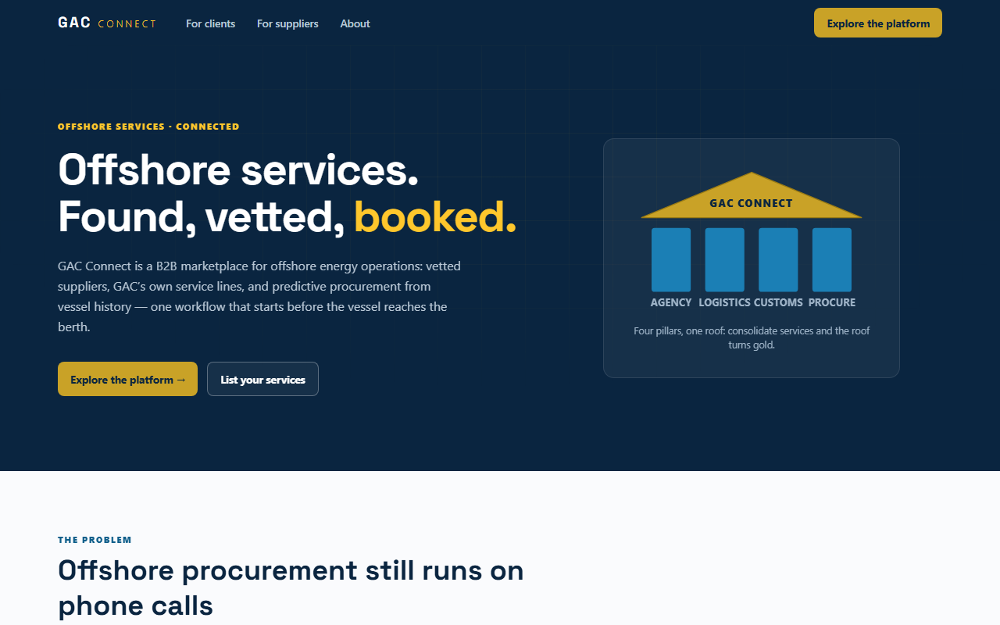

# GAC Connect

A proof-of-concept **B2B marketplace for offshore energy services**: vetted suppliers on one
side, operators and their vessels on the other, and GAC's in-house service lines — Agency,
Logistics, Customs, Assets, Procurement — woven through the middle, with a tier discount that
rewards consolidating spend and a Supplier Vetting System (SVS) that blocks lapsed suppliers
from booking, anywhere, automatically.

**Live:** https://alexwilco2012-cyber.github.io/gac-connect/



> Everything on the site is illustrative. All operators, vessels, suppliers, prices, ratings,
> and figures are fictional. This is a proof of concept, not a live service.

## Run it

```bash
npm install
npm run dev        # local dev server
npm test           # vitest — tier/SVS/marketplace/storage unit tests
npm run e2e        # playwright — five smoke journeys (installs Chromium once)
npm run lint       # eslint + prettier
npm run build      # production build (Pages base path aware)
```

## Deploy

Pushes to `main` run CI (lint, unit tests, build, Playwright smokes, brand-string guard) and
deploy `dist/` to GitHub Pages via `.github/workflows/deploy.yml`. Repo setting: **Pages →
Source → GitHub Actions**. Deep links survive refresh through the `404.html` SPA shim. To ship
under a custom domain, add a `CNAME` file to `public/` and change `base` in `vite.config.ts`.

To rebrand the entire site, change `BRAND_NAME` in `src/config/brand.ts` — it is the only
place the brand string is written (CI enforces this with a grep).

## Quality on the deployed site

Lighthouse (headless Chromium, lab): **Performance ≈ 95** (FCP 1.5 s · LCP 1.6 s · TBT 40 ms ·
CLS 0 — Speed Index alone is elevated because the signature loader animation plays during the
trace), **Accessibility: all audits pass**, **Best Practices: all audits pass**. The local
runner nulled the category aggregates, so the performance figure is computed from the audited
metric scores using Lighthouse's published weights. 29 unit tests and 5 Playwright smoke
journeys run green; deep links survive refresh via the 404 shim (verified live).

## Architecture in five lines

1. **Vite + React 18 + TypeScript (strict) + Tailwind 4**, tokens defined once in `src/styles/tokens.css` as CSS custom properties and mirrored into the Tailwind theme.
2. **React Router** with Pages-safe deep links; screens lazy-load per route; marketing shell and platform shell are nested layouts.
3. **Zustand + a storage adapter** (`src/lib/storage.ts`): all persistence goes through one interface, so a real backend replaces localStorage without touching UI code.
4. **Business logic lives in `src/lib`** (`tier.ts`, `svs.ts`, `marketplace.ts`) with the mandatory rule tests in `tests/` — the UI only renders what the lib computes.
5. **Mock data is typed and canonical** (`src/data/*.ts`), fictional names only, governed by the handoff package in `docs/handoff/` — `07_GUARDRAILS_CONFIDENTIALITY.md` overrides everything.
