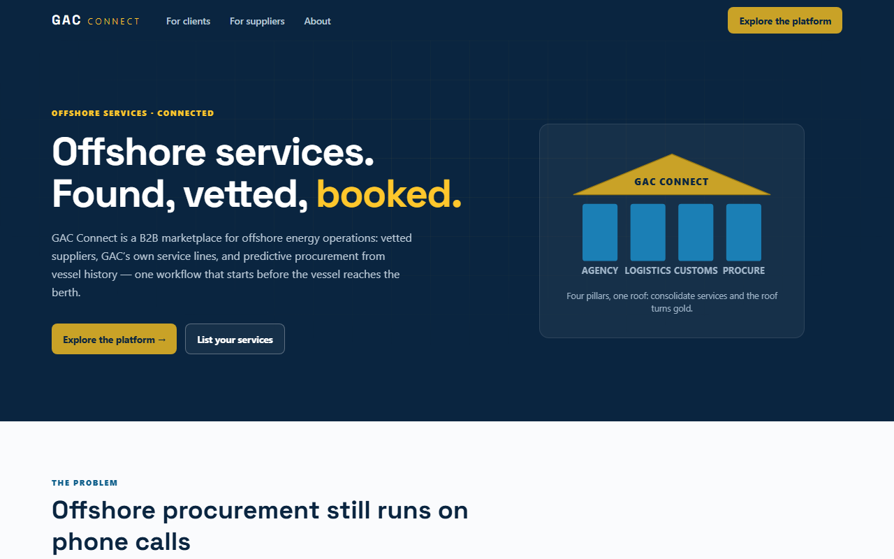

# GAC Connect

A proof-of-concept **B2B marketplace for offshore energy services**: vetted suppliers on one
side, operators and their vessels on the other, and GAC's in-house service lines — Agency,
Logistics, Customs, Assets, Procurement — woven through the middle, with a tier discount that
rewards consolidating spend and a Supplier Vetting System (SVS) that blocks lapsed suppliers
from booking, anywhere, automatically. Suppliers pay a commission only on work won through the
platform, banded by plan (Basic 20% · Professional 15% · Premium 10%) and deducted at invoice
matching; clients pay nothing to use it. Above standard verification sits **GAC Gold Band**, an
earned annual-audit tier for Premium suppliers. Supplier invoices route to the client first with
a seven-day window to allocate billing parties and splits before they match in GAC Agent, and
agents rate suppliers on job close-out — every rating shown carries the number submitted.

**Live:** https://alexwilco2012-cyber.github.io/gac-connect/



> Everything on the site is illustrative. All operators, vessels, suppliers, prices, ratings,
> and figures are fictional. This is a proof of concept, not a live service.

## Run it

```bash
npm install
npm run dev              # local dev server (builds the presenter into public/ first)
npm test                 # vitest — tier/SVS/marketplace/commission/invoice/request unit tests
npm run e2e              # playwright — ten smoke journeys (installs Chromium once)
npm run lint             # eslint + prettier
npm run build            # production build (Pages base path aware) — presenter + tsc + vite
npm run build:presenter  # presenter only (Python 3 required) → public/presenter.html + public/presenter/
```

## Two surfaces

- **The platform** — `src/`, Vite + React. Every screen is its own chunk; the first visit loads
  the landing page only and the rest is prefetched while the browser is idle.
- **The presenter** (`/presenter.html`, the pitch opener with the embedded platform demo) —
  `presenter/`, a modular source tree (`src/partials/` one file per screen, `src/app/` for data
  and behaviour, `src/styles/`) assembled by `presenter/build.py` into a small HTML page plus
  separate, cacheable files under `/presenter/` (runtime, React, fonts). Its outputs are
  generated at build time and gitignored. See `presenter/README.md`.

## Deploy, versions and previews

Every push to any branch runs CI (lint, unit tests, build, Playwright smokes, brand-string
guard) and the deploy workflow, which publishes **`main` as the live site** and **every other
branch as a preview** at `/preview/<branch>/` (slashes → dashes) — one Pages deployment, many
versions. Delete a branch and its preview is gone on the next publish; merge it and it is live.
Every merge to `main` is a saved version that can be restored. The owner's guide is
[`docs/WORKFLOW.md`](docs/WORKFLOW.md); the rules for editors are in `CLAUDE.md`.

Repo setting: **Pages → Source → GitHub Actions**. Deep links survive refresh through the
`404.html` SPA shim (preview-aware). To ship under a custom domain, add a `CNAME` file to
`public/`, change `base` in `vite.config.ts`, and update the preview base in
`.github/workflows/deploy.yml` and `public/404.html`.

To rebrand the entire site, change `BRAND_NAME` in `src/config/brand.ts` — it is the only
place the brand string is written (CI enforces this with a grep).

## Quality on the deployed site

Lighthouse (headless Chromium, lab): **Performance ≈ 95** (FCP 1.5 s · LCP 1.6 s · TBT 40 ms ·
CLS 0 — Speed Index alone is elevated because the signature loader animation plays during the
trace), **Accessibility: all audits pass**, **Best Practices: all audits pass**. The local
runner nulled the category aggregates, so the performance figure is computed from the audited
metric scores using Lighthouse's published weights. 67 unit tests and 10 Playwright smoke
journeys run green; deep links survive refresh via the 404 shim (verified live).

## Architecture in five lines

1. **Vite + React 18 + TypeScript (strict) + Tailwind 4**, tokens defined once in `src/styles/tokens.css` as CSS custom properties and mirrored into the Tailwind theme.
2. **React Router** with Pages-safe deep links; screens lazy-load per route; marketing shell and platform shell are nested layouts.
3. **Zustand + a storage adapter** (`src/lib/storage.ts`): all persistence goes through one interface, so a real backend replaces localStorage without touching UI code.
4. **Business logic lives in `src/lib`** (`tier.ts`, `svs.ts`, `marketplace.ts`, `commission.ts`, `invoices.ts`, `requests.ts`) with the mandatory rule tests in `tests/` — the UI only renders what the lib computes.
5. **Mock data is typed and canonical** (`src/data/*.ts`), fictional names only, governed by the handoff package in `docs/handoff/` — `07_GUARDRAILS_CONFIDENTIALITY.md` overrides everything.
